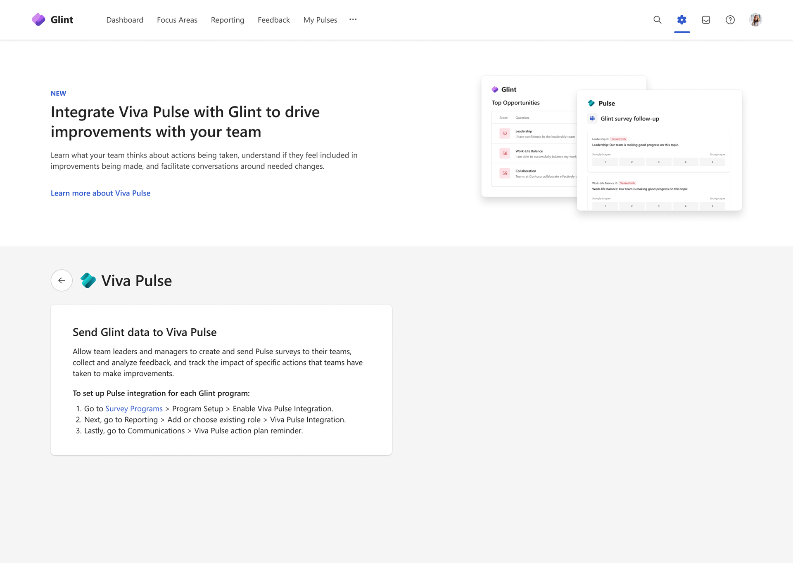
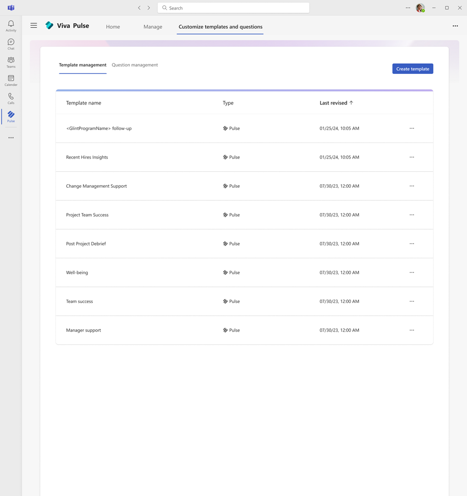
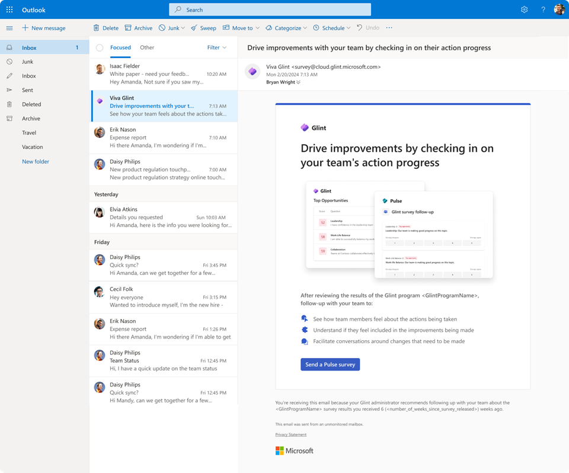
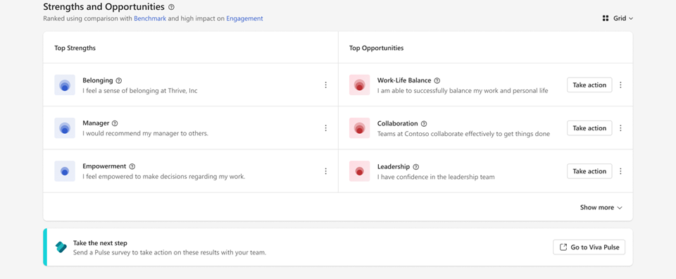

# Take actions with Viva Pulse after Viva Glint engagement surveys

Managers and leaders are empowered to gather additional information and check in on team progress by using Pulse to follow up with their teams after an org-wide Glint engagement survey. The Pulse survey recommends questions from the top strengths and opportunities identified in the Glint engagement survey, so managers and leaders can gather a timely understanding of the team’s progress to date in addressing key focus areas, make mid-point adjustments if needed, and maintain momentum in their efforts to improve engagement and employee experience.

To use Pulse to follow up with your teams after receiving your Glint engagement survey results, you must have one of the following subscription licenses:

* Viva Suite
* Viva Workplace Analytics and Employee Feedback

## Set up Pulse follow-ups as a Glint admin

As a Glint admin, you must first enable the Pulse integration for your Glint survey programs for users in your tenant to use Viva Pulse to follow up with their teams about action item progress. You can configure the Glint survey programs that have the Pulse integration enabled, the user roles who will receive the Glint email to use Pulse to follow up with their team, the timing of the Glint email to those selected user roles, the content of the Glint email, and the localizations for the Glint email.

1. Click on the **gear icon** in Viva Glint to enter the Glint general admin page and under **Microsoft Viva Integrations**, click on **Viva Pulse**.
2. To set up the Pulse integration for a Glint survey program, click on **Survey programs** in the card to send Glint data to Pulse and select the Glint survey program you want to enable the Pulse follow-ups for.
3. In the **Program Setup** page for the selected Glint survey program, click on **Enable Viva Pulse Integration**. There is a tooltip that indicates that more configuration is required.
4. In the **Reporting** page for the Glint survey program, select the user roles who will receive access to Viva Pulse with the questions under **Question Reporting Access** and click on **Viva Pulse Integration**. There will be a tooltip that indicates that additional configuration is required.
    1. Note that if a user has multiple roles, each role needs to have the Pulse integration enabled to receive access to all the questions under **Question Reporting Access**. Additionally, all users within the user role must have a Viva Pulse license for the Pulse integration to be enabled.
    2. Note that reserved roles like company admins, service accounts, and system admins have the Pulse integration default off and this setting will not be configurable because they are not the target users for tracking action items and addressing key focus areas with their teams.
5. In the **Communications** page, there is a **Viva Pulse action reminder** card at the bottom of the page. Click on the card and under **Send the reminder**, configure the timing of the notification to the user roles you enabled the Pulse integration for. Note that we recommend 40 days for the notification timing because we believe this timeframe is sufficient for having team conversations prior to the next Glint survey.
    1. You can preview the email notification and edit the email content including the subject, greeting, body, and button by clicking on the **Edit** tab.
    1. If you have employees in multiple countries, you can configure multiple localizations for the email content in the **Edit** tab.

## Review Pulse follow-up template as a Pulse content admin

As a Pulse content admin, you can configure the content in the follow-up template available in Viva Pulse, including the questions available in the template and the questions themselves. The content can be configured under **Customize templates and questions**.

To configure the follow-up template, click on the **Template management** tab:

1. Edit the follow-up template by clicking on **`<GlintProgramName>` follow-up** in the list of templates.
    1. Edit the name of the template by clicking into the field for **`<GlintProgramName>` follow-up** at the top of the page. Note that the `<GlintProgramName>` is static text and cannot be removed.
    2. Edit the questions in the follow-up template by clicking on the question cards and modifying the question text and question type. You can remove questions in the template by clicking on the **trashcan icon** on the question cards.
    3. Add questions to the follow-up template by browsing the question library or creating new questions by clicking on the button to **Add a question**.
    4. Once you complete editing the questions available in the follow-up template, edit the description for the follow-up template and click **Save and keep template activated**.
2. Deactivate the follow-up template by clicking on the **…** next to **`<GlintProgramName>` follow-up** in the list of templates and click **Deactivate template**.
    1. Note that deactivating the follow-up template disrupts the Pulse integration for the Glint survey programs where the integration is enabled. If you want to deactivate the Pulse integration, disable the integration in the Glint admin setup.

To configure the questions in the follow-up template, click on the **Question management** tab:

1. Edit the questions in the follow-up template by clicking on the questions under the **`<GlintProgramName>` follow-up** topic.
    1. Edit the question text and scale labels.
    2. Choose the question topics you want the question to be displayed in for survey authors.
    3. Click **Save and keep question activated to save your updates**.
    4. Note that the **“`<GlintItem>`: Our team is making good progress on this topic”** question is unique in that the `<GlintItem>` is static text and cannot be edited because these are the top opportunities and strengths pulled from the Glint survey results. You also cannot change the question topics for which this question is displayed because this question is specific to the Glint and Pulse integration.
2. Deactivate the questions in the follow-up template by clicking on the **…** next to the questions under the **`<GlintProgramName>` follow-up** topic and click **Deactivate question**.
    1. Note that deactivating the **“`<GlintItem>`: Our team is making good progress on this topic”** question prevents survey authors from using Glint survey program-specific questions. By deactivating this question, survey authors will not have their top opportunities or strengths pulled in from their Glint survey results.

## Create a Pulse survey as a manager or leader

As a manager or leader, you can use Viva Pulse to follow up with your teams to capture feedback on the action items you had defined after reviewing the latest Glint survey results together. Pulse helps you gather a timely understanding of the team’s progress to date in addressing key focus areas, make mid-point adjustments if needed, and maintain momentum in your efforts to improve engagement and employee experience.

1. From the Glint email notification to drive improvements with your team by checking in on their action progress, click on **Send a Pulse survey**.
    1. Alternatively, you can use Pulse to follow up with your team via the Pulse banner on the executive summary and team summary pages. Click on **Go to Viva Pulse**.
    

1. Read the value proposition for the Pulse follow-ups integration and click **Next**.
1. View the list of top opportunities and strengths pulled in from the Glint survey results and the research-backed questions, select those that are relevant to your team, and click **Next**. You can view the Glint item from the latest Glint survey by hovering on the tooltips next to the questions pulled from the Glint survey results.
1. Review your Pulse survey content and click **Next**. If you need to add more questions from the Glint follow-up question topic, click on **Glint follow-up** under the **Add questions by topic** on the left side of the page. You can also remove questions by clicking on the **trashcan icon** on the question cards and edit the question text and question type for each question.
1. Finalize your Pulse survey after reviewing the send options and personal note for your Pulse and click **Send pulse**. Your direct reports are automatically populated under the **Request feedback from** field, and you can add or remove recipients.
